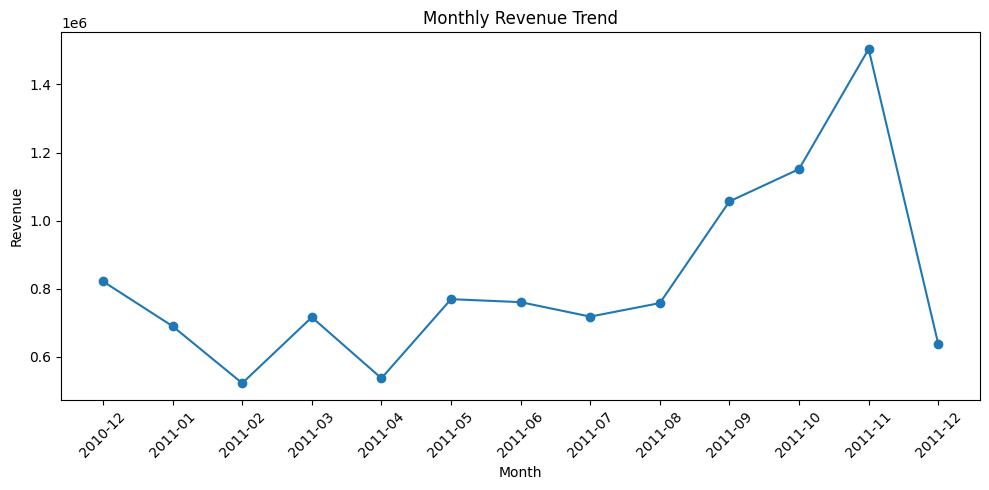

# E-Commerce Customer & Sales Analysis

## Project Overview

This project analyzes transactional data from a UK-based online retail business to uncover insights into sales performance, customer behavior, product performance, geographic revenue concentration, purchasing patterns, and cancellations.

The goal was to transform raw transaction-level data into reliable, business-focused insights using Python-based data analysis techniques.

---

## Business Objectives

The analysis was designed to answer questions such as:

- How much revenue did the business generate?
- How many completed orders and identifiable customers were recorded?
- Which months performed best?
- Which products generated the most revenue?
- Who are the highest-value customers?
- What percentage of customers made repeat purchases?
- Which countries contributed the most revenue?
- How concentrated is revenue among top customers?
- At what times are customers most active?
- How significant are order cancellations?

---

## Tools & Technologies

- **Python**
- **Pandas**
- **NumPy**
- **Matplotlib**
- **Google Colab**

---

## Dataset

The dataset contains product-level transaction records from an online retail business operating primarily in the United Kingdom.

### Main Columns

| Column | Description |
|---|---|
| `InvoiceNo` | Unique invoice / transaction identifier |
| `StockCode` | Product identifier |
| `Description` | Product name |
| `Quantity` | Number of units purchased |
| `InvoiceDate` | Date and time of the transaction |
| `UnitPrice` | Price per unit |
| `CustomerID` | Unique customer identifier |
| `Country` | Customer country |

The dataset includes both completed and cancelled transactions.

---

## Project Workflow

1. **Data Understanding**
2. **Data Quality Assessment**
3. **Data Cleaning**
4. **Feature Engineering**
5. **Exploratory Data Analysis**
6. **Customer & Product Analysis**
7. **Geographic Analysis**
8. **Cancellation Analysis**
9. **Behavioral Analysis**
10. **Data Visualization**
11. **Business Insights & Recommendations**

---

## Data Cleaning & Preparation

The following steps were performed to prepare the data for analysis:

- Preserved an untouched copy of the raw dataset.
- Removed exact duplicate rows.
- Identified cancelled invoices using invoice numbers beginning with `C`.
- Separated cancelled transactions from valid completed sales.
- Removed transactions with non-positive quantities or unit prices from valid sales analysis.
- Preserved transactions with missing `CustomerID` for sales-level analysis.
- Created a separate customer-level dataset containing only identifiable customers.
- Created a `Revenue` feature:

```python
Revenue = Quantity * UnitPrice
```

- Extracted time-based features including:
  - Year
  - Month
  - Year-Month
  - Day
  - Weekday
  - Hour
- Validated the cleaned dataset to confirm that duplicate rows and invalid sales values had been removed.

---

## Key Performance Indicators

| KPI | Result |
|---|---:|
| **Total Revenue** | **£10.64M** |
| **Completed Orders** | **19,960** |
| **Identifiable Customers** | **4,338** |
| **Average Order Value** | **~£533** |
| **Repeat Customer Rate** | **~65.6%** |
| **Cancellation Rate** | **~14.8%** |

---

## Key Findings

### 1. Revenue Performance
The business generated approximately **£10.64 million** in revenue from **19,960 completed orders**.

Revenue increased strongly during the later months of 2011, with **November 2011** recording the strongest monthly revenue among the complete months in the dataset.

> **Note:** December 2011 contains only partial-month data, so it should not be compared directly with complete months.

### 2. Customer Behavior
A total of **4,338 identifiable customers** made purchases.

Approximately **65.6% of identifiable customers placed more than one order**, indicating strong repeat purchasing behavior.

Customer spending was highly right-skewed, meaning a relatively small number of high-value customers contributed disproportionately to revenue.

### 3. Customer Revenue Concentration
The **top 10 customers contributed approximately 17.3% of identifiable customer revenue**.

This shows that a small group of high-value customers plays an important role in overall business performance.

### 4. Geographic Performance
The **United Kingdom contributed approximately 84.6% of total revenue**, demonstrating a high level of geographic concentration.

Among international markets, countries such as the **Netherlands, EIRE, Germany, France, and Australia** showed meaningful revenue contribution.

### 5. Product Performance
After excluding non-merchandise entries such as postage and manual adjustments, **REGENCY CAKESTAND 3 TIER** emerged as one of the strongest merchandise products by revenue.

The analysis also showed that products with the highest sales volume are not always the products generating the highest revenue.

### 6. Purchasing Behavior
Order activity peaked around **12:00 PM**, with late morning to early afternoon representing the busiest purchasing period.

Revenue was strongest on selected weekdays, while no Saturday transactions were observed in the dataset.

### 7. Cancellation Analysis
The dataset contained approximately **3,836 cancelled invoices**, representing about **14.8% of all unique invoices**.

The estimated gross value associated with cancelled transactions was substantial, indicating that cancellations may represent an important operational area for further investigation.

> The estimated cancelled value should not automatically be interpreted as confirmed lost revenue because the dataset does not provide complete operational context for returns, corrections, or replacements.

---

## Business Recommendations

### Strengthen Customer Retention
Since repeat customers represent a large share of the customer base, the business should consider loyalty programs, personalized offers, and targeted retention campaigns.

### Protect High-Value Customers
High-value customers contribute a meaningful share of revenue. These customers should receive focused retention strategies, personalized communication, and potentially priority service.

### Reduce Geographic Dependency
Because the UK contributes the majority of revenue, the business should evaluate opportunities to expand in international markets that already demonstrate meaningful demand.

### Investigate Cancellation Drivers
Cancellation patterns should be analyzed further by product, customer, and time period to identify potential issues related to fulfillment, product quality, customer expectations, or operational processes.

### Optimize Marketing Timing
Since customer activity peaks around midday, promotions and customer engagement campaigns may be more effective when aligned with high-activity periods.

### Prioritize High-Performing Merchandise
Strong merchandise products should receive greater attention in inventory planning, promotions, and cross-selling strategies.

### Develop Customer Segmentation
Customers should be segmented using spending level, purchase frequency, and order behavior to support more targeted retention and marketing strategies.

---

## Visualizations

The project includes visual analysis of:

- Monthly revenue trend
- Top merchandise products by revenue
- Revenue by weekday
- Orders by hour

Suggested repository image structure:

```text
images/
├── monthly_revenue.png
├── top_products.png
├── weekday_revenue.png
└── hourly_orders.png
```

Example README usage:

```markdown

```

---

## Repository Structure

```text
ecommerce-sales-analysis/
│
├── README.md
├── ecommerce_sales_analysis.ipynb
│
├── data/
│   └── Online_Retail.xlsx
│
└── images/
    ├── monthly_revenue.png
    ├── top_products.png
    ├── weekday_revenue.png
    └── hourly_orders.png
```

---

## How to Run the Project

1. Clone or download the repository.
2. Open `ecommerce_sales_analysis.ipynb` in Google Colab or Jupyter Notebook.
3. Ensure the dataset path matches the notebook path.
4. Run the notebook from top to bottom.
5. Review the analysis, visualizations, findings, and recommendations.

---

## Skills Demonstrated

- Data cleaning and validation
- Missing-value handling
- Duplicate detection
- Feature engineering
- Exploratory data analysis
- Grouping and aggregation
- Customer analysis
- Product analysis
- Time-series analysis
- Business KPI calculation
- Data visualization
- Business insight generation
- Analytical storytelling

---

## Conclusion

This project demonstrates an end-to-end analytical workflow, from raw transactional data through cleaning, feature engineering, exploratory analysis, visualization, and business recommendations.

The analysis highlights strong repeat purchasing behavior and a valuable high-spending customer base, while also revealing significant dependence on the UK market and a notable level of order cancellations.

The resulting insights can support better decisions in customer retention, marketing, inventory planning, international growth, and operational improvement.
